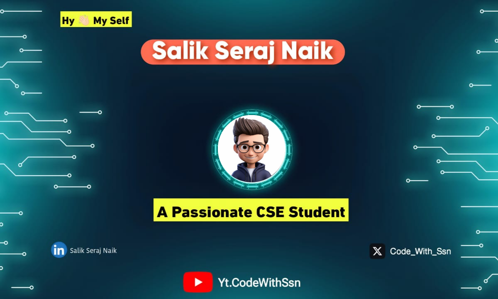

 </img>

Hi My name is Salik Seraj Naik
========================================================================================================================================

Computer Science Student | Exploring | Data Science | Cyber Security
--------------------------------------------------------------------

I started my journey in 2023. As a CSE student in a 3rd tier college, currently. I am upskilling my skills.

* 🌍  I'm based in India
* ✉️  You can contact me at [salikserajnaik@gmail.com](mailto:salikserajnaik@gmail.com)
* 🧠  I'm learning Python, Web Development
* 🤝  I'm open to collaborating on interesting Projects

 

### Skills

### Socials

  <a href="https://www.linkedin.com/in/salik-seraj-naik" target="_blank" rel="noreferrer"> <picture> <source media="(prefers-color-scheme: dark)" srcset="https://raw.githubusercontent.com/danielcranney/readme-generator/main/public/icons/socials/linkedin-dark.svg" /> <source media="(prefers-color-scheme: light)" srcset="https://raw.githubusercontent.com/danielcranney/readme-generator/main/public/icons/socials/linkedin.svg" />  </picture> </a>  <a href="https://www.x.com/code_with_ssn" target="_blank" rel="noreferrer"> <picture> <source media="(prefers-color-scheme: dark)" srcset="https://raw.githubusercontent.com/danielcranney/readme-generator/main/public/icons/socials/twitter-dark.svg" /> <source media="(prefers-color-scheme: light)" srcset="https://raw.githubusercontent.com/danielcranney/readme-generator/main/public/icons/socials/twitter.svg" />  </picture> </a> <a href="https://www.youtube.com/@Yt.CodeWithSsn" target="_blank" rel="noreferrer"> <picture> <source media="(prefers-color-scheme: dark)" srcset="https://raw.githubusercontent.com/danielcranney/readme-generator/main/public/icons/socials/youtube-dark.svg" /> <source media="(prefers-color-scheme: light)" srcset="https://raw.githubusercontent.com/danielcranney/readme-generator/main/public/icons/socials/youtube.svg" />  </picture> </a>

### Badges

<b>My GitHub Stats</b>

